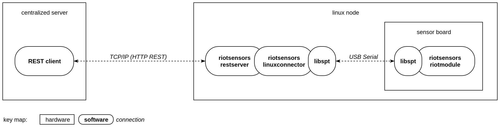

```
      _       _                                     
     (_)     | |                                    
 _ __ _  ___ | |_ ___  ___ _ __  ___  ___  _ __ ___ 
| '__| |/ _ \| __/ __|/ _ \ '_ \/ __|/ _ \| '__/ __|
| |  | | (_) | |_\__ \  __/ | | \__ \ (_) | |  \__ \
|_|  |_|\___/ \__|___/\___|_| |_|___/\___/|_|  |___/
```
# riotsensors

Module for [RIOT-OS](https://github.com/RIOT-OS/RIOT) to transfer sensor data from a board over a serial connection to
the connected device

## Module infrastructure

riotsensors consists of multiple modules which are shown in the following example hardware structure:



The sensor board from which the data should be retrieved is connected over a USB serial connection to a "fully functional" Linux computer, which is part of a network with possibly other other sensorboard-Linux-combinations and a central server.
The server uses REST requests to the Linux computers to retrieve the data from the boards.

## Data transfer
1. What data can be transferred?
  - Integer
  - Doubles
  - Strings
2. How is the data transferred from the board to the Linux machine?
  - The data is packet in binary packets which are sent via libspt. See the libspt documentation for more details.


## API usage

### API in RIOT-OS
See the project "riotsensors-example" for a usage example of riotsensors API for RIOT-OS.

### REST-API
Along with this project a [Swagger](http://swagger.io/) documentation is provided which shows the REST operations available on HTTP and CoAP.

## How to build

### Building the REST server
*soon*

### Building a RIOT application with riotsensors API
See the project "riotsensors-example" for a usage example of riotsensors in a RIOT-OS application and the build instructions.

## Used libraries
*soon*